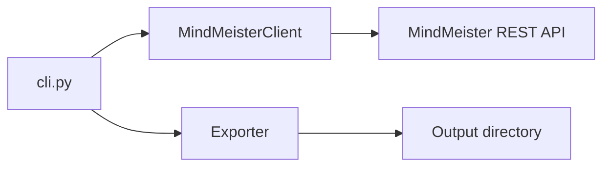

# Architecture

MapSnatch is a small Python CLI with three layers: **CLI**, **client**, **exporter**.

## Components

### `meister_export.cli`

- Parses arguments (`--format`, `--output`, `--token`, `--dry-run`)
- Loads token from `--token`, `MINDMEISTER_API_TOKEN`, or `.env` via `python-dotenv`
- Drives progress UI (`tqdm`) and exit codes

### `meister_export.client.MindMeisterClient`

- **List maps:** `GET /services/rest/oauth2?method=mm.maps.getList` (legacy REST, JSON)
- **Export map:** `GET /api/v2/maps/{id}.{format}` (v2 API, binary)
- Bearer token auth on a shared `requests.Session`
- Optional `rate_limit_delay` (default 0.5s) between export calls

### `meister_export.exporter.Exporter`

- Iterates `MapInfo` list from the client
- Writes files under `--output` with sanitised filenames
- For zip-wrapped formats (`mm`, `mind`, `xmind`), extracts the correct member by extension

## Data flow

1. Authenticate with a personal access token (never logged by the CLI).
2. Fetch full map list once.
3. For each map, download bytes for the chosen format.
4. Save to disk; failures surface per-map without stopping the whole run (see tests for behavior).

## Non-goals

- No local database or cloud storage
- No OAuth app flow (personal token only)
- No modification of maps on MindMeister

## Related

- Hosted web app (Stripe, zip in browser) is a separate codebase — same API concepts, different trust boundary.
